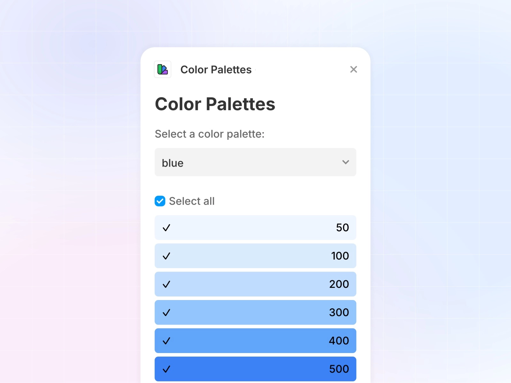

Managing colour palettes in your design projects can be a bit of a headache. Fortunately, Framer's plugin ecosystem offers some brilliant solutions to make working with colours much easier. Let's explore three fantastic plugins that will help you manage your colour palettes more efficiently.

## 1. [Color Palettes plugin](/plugins/color-palettes)

If you're a fan of Tailwind CSS's colour system (and let's be honest, who isn't?), this plugin is a game-changer. The [Color Palettes](/plugins/color-palettes) plugin brings Tailwind's carefully crafted colour palettes directly into your Framer workspace, making it dead simple to maintain consistency in your designs.

What makes this plugin particularly useful is how it handles dark mode. With just one click, you can generate inverted colour palettes for dark themes, saving you loads of time that you'd otherwise spend manually adjusting colours. The interface is straightforward, letting you pick specific shades from Tailwind's system without any fuss.

Price: **Free**  
Plugin link: [Color Palettes](/plugins/color-palettes)

## 2. [Radix Colors plugin](/plugins/radix-colors)

Accessibility in design isn't just a nice-to-have anymore - it's essential. That's where the [Radix Colors](/plugins/radix-colors) plugin comes in handy. This plugin gives you access to 30 professionally curated colour scales that are designed with accessibility in mind right from the start.

The beauty of Radix Colors lies in its simplicity. You get colour combinations that are guaranteed to meet accessibility standards, and like the Tailwind plugin, it includes automatic light and dark mode support. If you're working on projects where accessibility is crucial (which should be all of them, really), this plugin is a proper lifesaver.

Price: **Free**  
Plugin link: [Radix Colors](/plugins/radix-colors)

## 3. [Styles IO plugin](/plugins/styles-io)

While not exclusively a colour palette plugin, [Styles IO](/plugins/styles-io) deserves a spot on this list for its brilliant handling of colour styles across different projects. Think of it as your style management assistant that helps you maintain consistency across all your Framer projects.

The plugin lets you export your colour styles to a JSON file and import them into other projects with just a few clicks. What's particularly clever is its smart updating system - it can automatically update existing styles and add new ones without messing up your current setup. It's brilliant for teams working on multiple projects who need to keep their branding consistent.

Price: **Free**  
Plugin link: [Styles IO](/plugins/styles-io)

## Which One Should You Choose?

Each of these plugins serves a slightly different purpose:
- Go for Color Palettes if you're already familiar with Tailwind and want its colour system in Framer
- Choose Radix Colors if accessibility is a top priority and you want pre-vetted, accessible colour combinations
- Pick Styles IO if you work across multiple projects and need to keep your colour styles consistent

These plugins are just the tip of the iceberg when it comes to enhancing your Framer workflow. Whether you're just starting with Framer or you're a seasoned pro, having the right tools can make a world of difference in your design process.

*Want to explore more plugins for your Framer projects? Check out our [complete collection of Framer plugins](/plugins) to find more tools that match your design needs.*