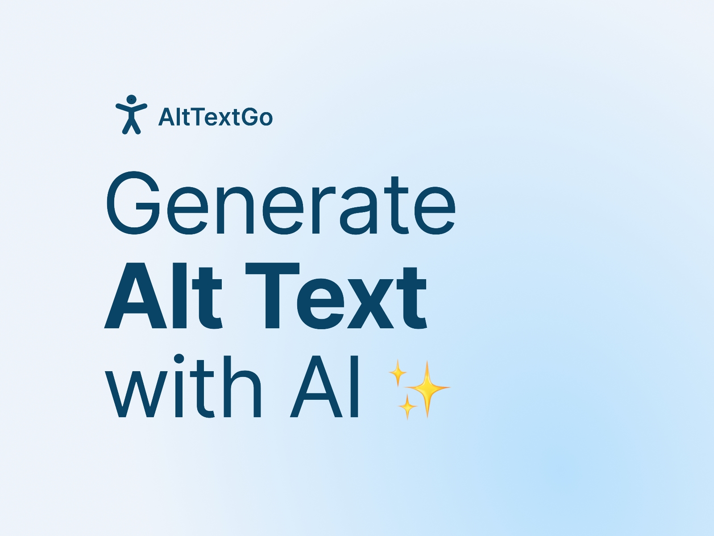
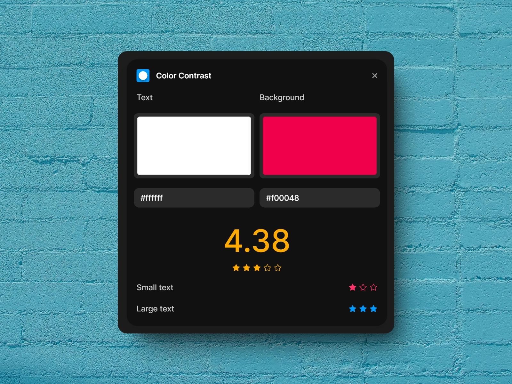
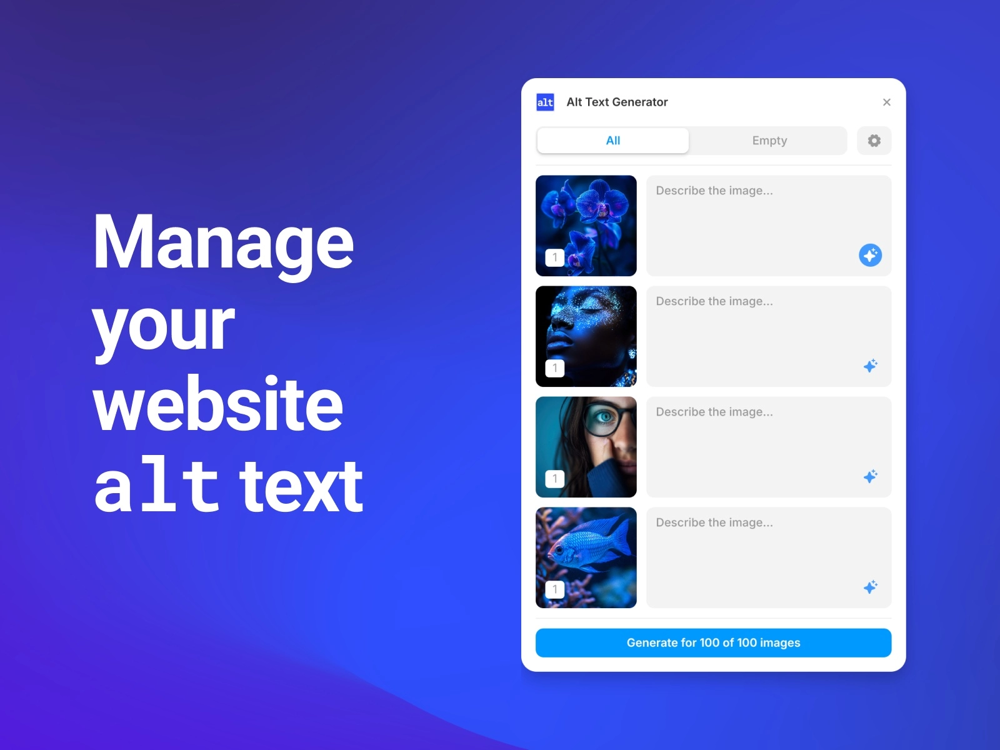

Making websites accessible isn't just a nice-to-have anymore - it's essential. But let's be honest, implementing accessibility features can sometimes feel like a lot of work. Luckily, there are some brilliant Framer plugins that make this job much easier.

Let's explore three best accessibility plugins that will help you create websites everyone can use and enjoy, regardless of their abilities.

## 1. [Alt Text Go](/plugins/alt-text-go)

Ever struggled with writing alt text for your images? [Alt Text Go](/plugins/alt-text-go) is here to save the day with its clever AI technology. Think of it as your personal assistant that looks at your images and automatically writes clear descriptions for them.

What makes Alt Text Go particularly brilliant is how seamlessly it fits into your workflow. You don't need to leave Framer or use any external tools - everything happens right where you're already working. It works with both your regular images and ones from your CMS, so you're covered no matter how you manage your content.

The plugin also gives you a neat list view of all your images, making it really easy to spot any missing alt text. Plus, if you're keen on SEO (as you should be), you can include relevant keywords in the generated descriptions to give your website that extra boost in search results.

Price: **Paid**  
Plugin link: [Alt Text Go](/plugins/alt-text-go)

## 2. [Color Contrast](/plugins/color-contrast)

Here's a free plugin that's absolutely essential for any designer. The [Color Contrast](/plugins/color-contrast) plugin does exactly what it says on the tin - it helps you check if your text is actually readable against its background.

What's really clever about this plugin is its traffic light system. Blue means your contrast is spot on, yellow suggests it's acceptable but could be better, and red is basically saying "mate, nobody's going to be able to read that." It checks both small and large text separately because they have different requirements for accessibility.

The best part? You get to see a preview of how your text will look, so you're not just working with abstract numbers. It's like having a accessibility expert looking over your shoulder, but without the awkward hovering.

Price: **Free**  
Plugin link: [Color Contrast](/plugins/color-contrast)

## 3. [Alt Text Generator](/plugins/alt-text-generator)

Another great tool for managing alt text, this one's particularly useful if you're dealing with loads of images. The [Alt Text Generator](/plugins/alt-text-generator) plugin can handle up to 100 images at once, which is proper handy when you're working on bigger projects.

Like Alt Text Go, it uses AI to generate descriptions, but what sets it apart is its bulk processing capability. Imagine being able to sort all your website's alt text in one go, rather than clicking through images one by one. That's the kind of time-saver we all need!

The plugin also gives you a central hub where you can view and manage all your alt text. This makes it much easier to keep track of everything and ensure you're maintaining consistent quality across your whole site.

Price: **Paid**  
Plugin link: [Alt Text Generator](/plugins/alt-text-generator)

## Which One Should You Choose?

If you're wondering which plugins to go for, here's a quick guide:

- For image descriptions: Both Alt Text Go and Alt Text Generator are solid choices. Go for Alt Text Go if you prefer working with images individually, or Alt Text Generator if you need to process lots of images at once.
- For colour accessibility: Color Contrast is a no-brainer - it's free, simple to use, and does its job brilliantly.
- The best part is that these plugins can work together. There's nothing stopping you from using all three to create a properly accessible website.

Making your websites accessible doesn't have to be complicated or time-consuming anymore. These plugins help you tackle some of the most common accessibility challenges without getting bogged down in technical details.

Remember, good accessibility isn't just about ticking boxes - it's about making sure everyone can use and enjoy your websites. And with these plugins, that job just got a whole lot easier.

*Want to explore more plugins for your Framer projects? Check out our [complete collection of Framer plugins](/plugins) to find more tools that match your design needs.*