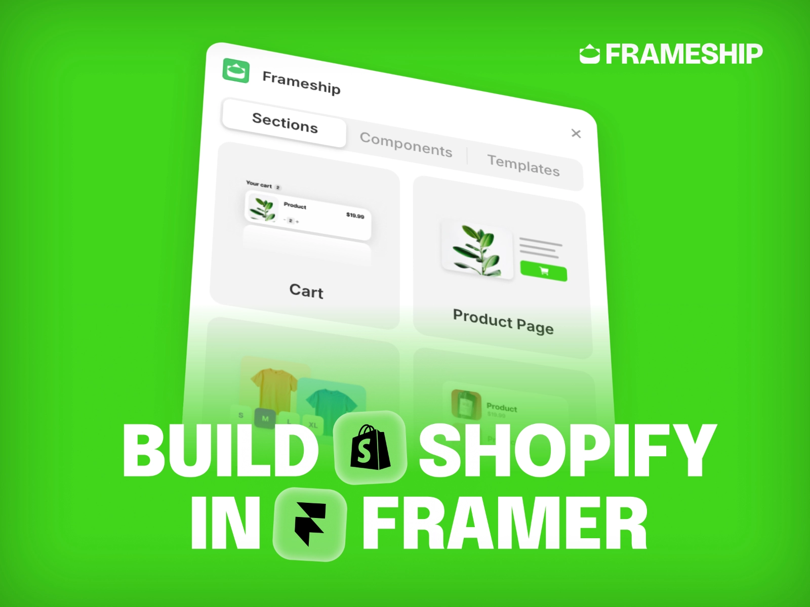
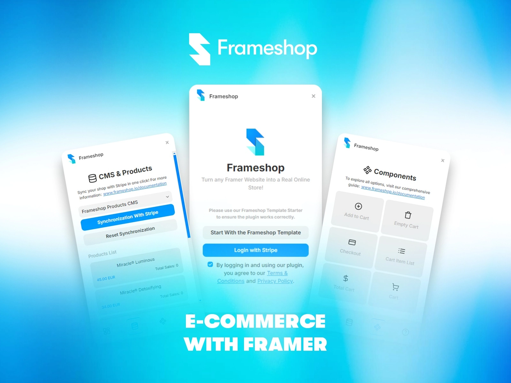
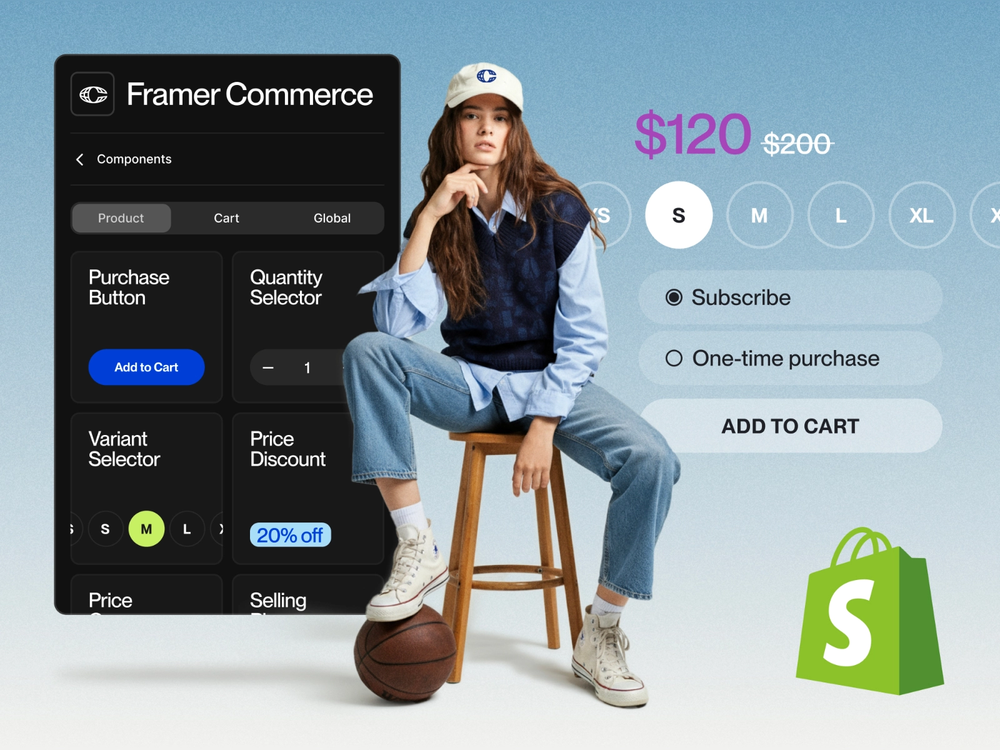
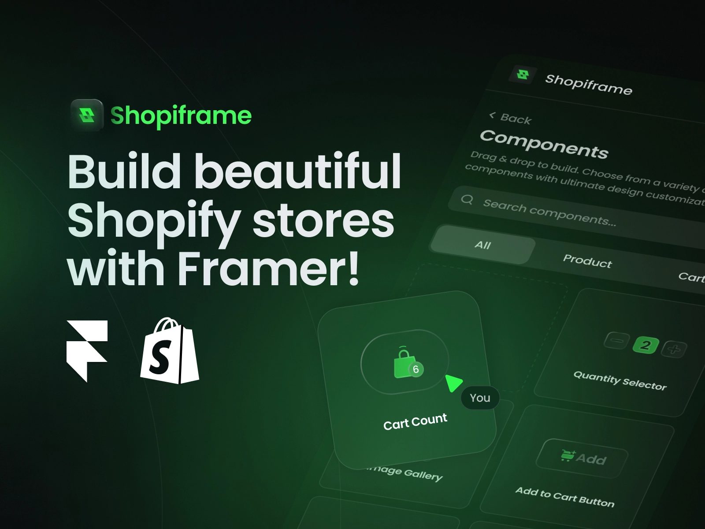

Want to turn your Framer website into an online shop? There are some brilliant plugins that can help you create a professional e-commerce site without getting lost in complex code. Let's explore five fantastic plugins that make selling online a breeze.

## 1. [Frameship](/plugins/frameship)

If you're looking for a powerful way to build Shopify stores, [Frameship](/plugins/frameship) is a game-changing option. This plugin lets you create complete online shops using Framer's design tools, without writing a single line of code. What's brilliant about it is how quickly you can get started - connecting your Shopify store takes less than a minute.

The plugin comes with over 20 ready-made e-commerce components that you can simply drag and drop into your design. Everything syncs automatically with your Shopify data, so you don't have to worry about keeping product information up to date. Plus, it's built with SEO in mind, helping your store get noticed online.

Price: **Paid** (10% OFF with code **FMPT10**)  
Plugin link: [Frameship](/plugins/frameship)

## 2. [Frameshop](/plugins/frameshop)

If you're just starting with e-commerce, [Frameshop](/plugins/frameshop) is a perfect choice. This free plugin lets you create a complete online store right within Framer. What's great about it is how it handles everything you need - from displaying products to managing your inventory.

The plugin works seamlessly with Stripe for payments, so you don't have to worry about the technical bits of handling transactions. You can keep track of your stock levels directly in Framer's CMS, and it even prevents you from selling items that are out of stock. Plus, you can customise how everything looks to match your brand perfectly.

Price: **Free**  
Plugin link: [Frameshop](/plugins/frameshop)

## 3. [Framer Commerce](/plugins/framer-commerce)

If you're planning to use Shopify for your online store, [Framer Commerce](/plugins/framer-commerce) is your best mate. This paid plugin creates a perfect bridge between Framer and Shopify, keeping everything in sync between the two platforms.

The plugin comes packed with useful features like live stock status display and customisable product components. It can handle different product variants and even supports multiple languages, so you can sell to customers worldwide. While it's not free, it's worth considering if you're serious about building a professional Shopify store.

Price: **Paid**  
Plugin link: [Framer Commerce](/plugins/framer-commerce)

## 4. [FramerShop](/plugins/framershop)

[FramerShop](/plugins/framershop) takes a different approach that designers will love. Instead of starting with ready-made templates, you get to design your dream store layout first and then bring it to life with real product information. It's like having the freedom to paint on a blank canvas before adding all the shop features.

What makes this plugin particularly clever is how it connects your designs to actual product data. You can simply drag and drop product information onto your design elements, and everything stays up to date automatically. It even comes with a demo template to help you get started quickly.

Price: **Free**  
Plugin link: [FramerShop](/plugins/framershop)

## 5. [Shopiframe](/plugins/shopiframe)

Another brilliant option for Shopify users is [Shopiframe](/plugins/shopiframe). This paid plugin focuses on making it super easy to connect your Shopify store with your Framer designs. You can start designing straight away using their drag-and-drop components or ready-made templates.

What's particularly nice about Shopiframe is that it keeps all your product data (like prices and stock levels) up to date automatically. The team behind it is constantly adding new features too, like user dashboards and sign-up systems, so your store can grow with your needs.

Price: **Free**  
Plugin link: [Shopiframe](/plugins/shopiframe)

**Ready to Start Selling Online?**

Whether you're just testing the waters with a free plugin like Frameshop, or ready to dive deep with a Shopify integration tool like Frameship or Framer Commerce, there's a perfect solution for your needs. Each plugin offers its own unique advantages, so think about what matters most for your store - whether that's design flexibility, ease of use, or advanced features.

Want to explore more ways to enhance your Framer-powered online store? Check out our complete collection of [e-commerce plugins](/categories/ecommerce) – we're always updating our list with the latest tools to help you create the perfect online shopping experience.

You may also want to read about:
- [Best Framer plugins to improve your productivity as a designer](/blog/best-framer-plugins-to-improve-your-productivity-as-a-designer)
- [Best Framer Plugins to Start a Blog](/blog/best-framer-plugins-start-blog)
- [Best Framer Plugins for Search Engine Optimisation](/blog/best-framer-plugins-for-search-engine-optimisation)

