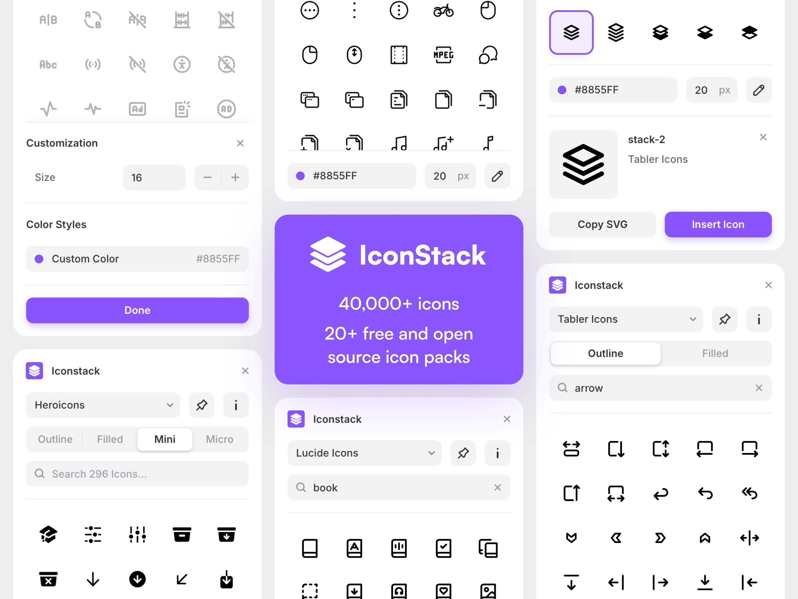
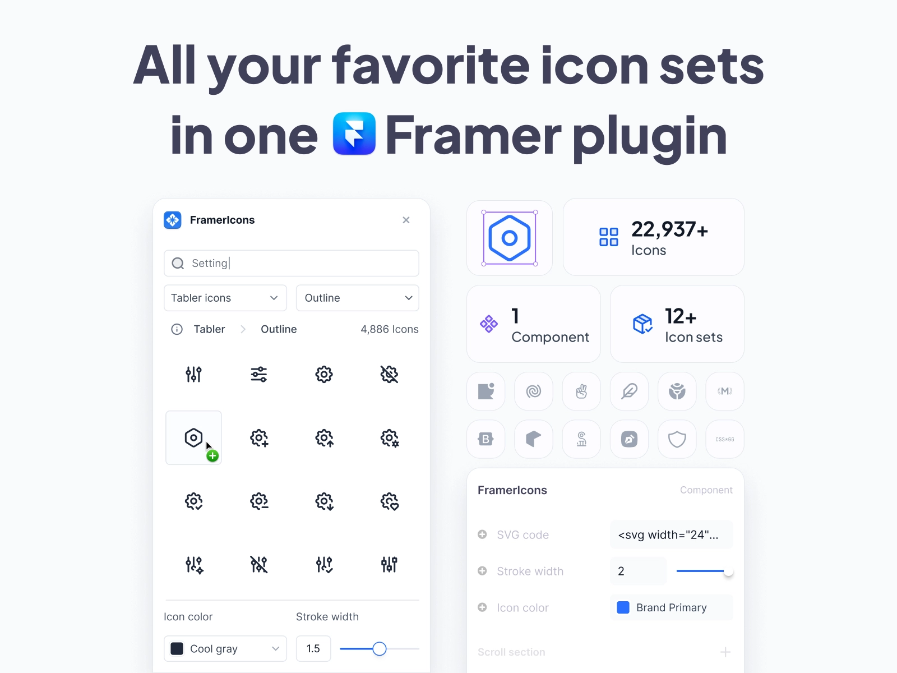
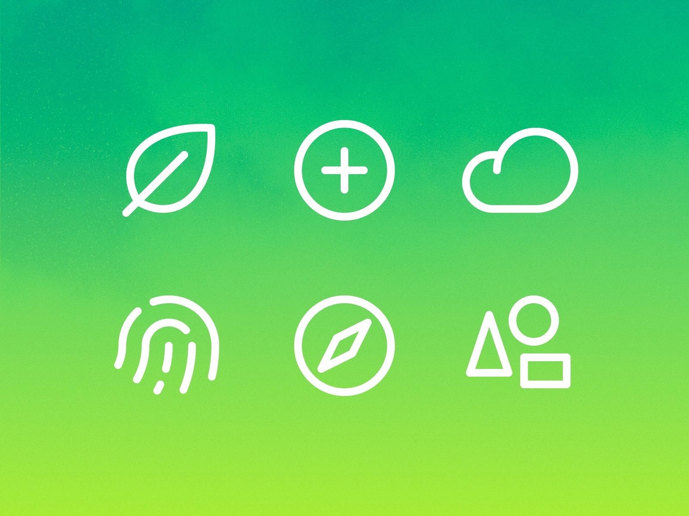
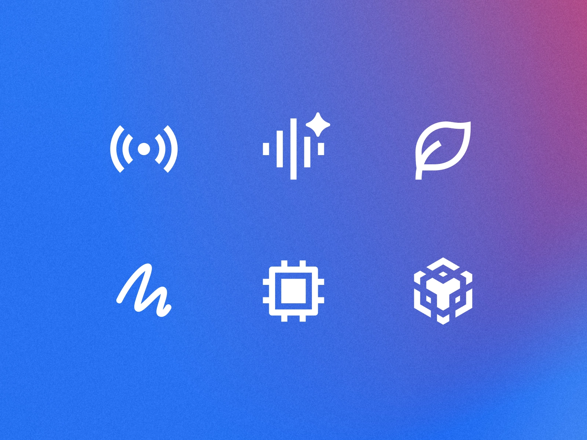

Icons can make or break a design. They help users understand your interface quickly and add that extra bit of polish to your work. But finding and managing icons shouldn't be a hassle. Let's look at some brilliant Framer plugins that make working with icons a breeze.

## 1. [Iconstack](/plugins/iconstack)

If you're after variety without spending a penny, [Iconstack](/plugins/iconstack) is your best bet. This free plugin gives you access to a whopping 40,000+ icons from more than 20 different icon packs. That's a lot of icons to play with!

What makes Iconstack particularly useful is how easy it is to find what you're looking for. The search feature is properly good, so you won't waste time scrolling through thousands of icons. Plus, you can tweak the size and colour of any icon before you pop it into your design. Just drag and drop the icon you want, and you're sorted.

Price: **Free**  
Plugin link: [Iconstack](/plugins/iconstack)

## 2. [FramerIcons](/plugins/framericons)

[FramerIcons](/plugins/framericons) is a bit special. While it's a paid plugin, it gives you access to 22,000+ carefully chosen icons from 12 different sets. The really cool bit? You can upload your own icon sets too, which is brilliant if you've got specific brand icons to work with.

This plugin works seamlessly with Framer's component system, so your icons won't mess up your design structure. You can customise them however you like using the component settings, making it dead easy to match your design style. If you're working on professional projects and need reliable, high-quality icons, this one's worth considering.

Price: **Paid**  
Plugin link: [FramerIcons](/plugins/framericons)

## 3. [Phosphor](/plugins/phosphor)

Sometimes less is more, and that's where [Phosphor](/plugins/phosphor) shines. This free plugin focuses on one icon collection, but it does it really well. You get six different styles to choose from, and every icon can be sized exactly how you want it without losing quality.

What's nice about Phosphor is how straightforward it is. One click to add an icon to your canvas, drag and drop to place it exactly where you want it. No faffing about with complicated settings – just pick, click, and you're done. It's perfect when you want a consistent look across your whole design.

Price: **Free**  
Plugin link: [Phosphor](/plugins/phosphor)

## 4. [Remixicon](/plugins/remixicon)

[Remixicon](/plugins/remixicon) brings another popular icon library right into Framer. It's free and gives you loads of options with its two main styles: line and fill. This means you can switch between outlined and solid versions of icons to match your design vibe.

The search feature works with tags, so finding the right icon is quick and easy. Just type what you're looking for, and it'll show you all the matching icons. Like the other plugins, it's got that handy drag-and-drop feature that makes adding icons to your design super simple.

Price: **Free**  
Plugin link: [Remixicon](/plugins/remixicon)

Whether you need thousands of icons at your fingertips with Iconstack, premium quality with FramerIcons, simple consistency with Phosphor, or the flexibility of Remixicon, there's an icon plugin that'll suit your needs. The best part? Most of these are free, so you can try them out and see which one works best for you.

Ready to level up your icon game? Head over to our plugins section to explore these and many other brilliant tools that'll make your Framer designs even better.

*Want to explore more plugins for your Framer projects? Check out our [complete collection of Framer plugins](/plugins) to find more tools that match your design needs.*
