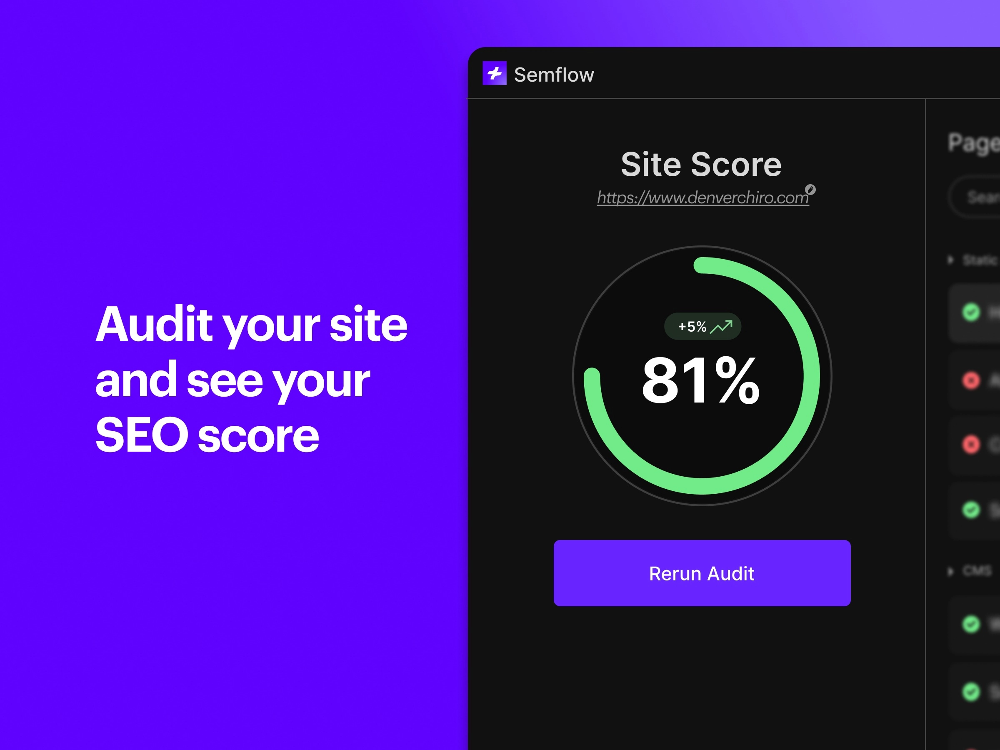

Search engine optimisation (SEO) plays a crucial role in your website's visibility and performance. While you're focused on creating beautiful designs in Framer, implementing proper SEO strategies is essential for reaching your target audience. 

Fortunately, there are plugins that can streamline this process. Let's look at two excellent plugins that can boost your website's search engine performance without leaving your favourite design tool.

## 1. [Semflow](/plugins/semflow)

If you're serious about optimising your Framer website for search engines, [Semflow](/plugins/semflow) is a comprehensive solution worth considering.

This powerful plugin acts like your personal SEO consultant, crawling through your website to identify areas for improvement.

What makes Semflow particularly useful is its ability to provide detailed SEO audits of your entire site. It examines crucial ranking factors and assigns your site a score based on its "rankability" in search engines. This scoring system helps you understand where you stand and what needs attention.

One of its standout features is the AI-powered content generation tool. Struggling to write compelling page titles and meta descriptions? Semflow's AI can help create these based on your focus keywords, saving you time and potentially improving your click-through rates from search results.

The plugin also integrates PageSpeed Insights, helping you ensure your site isn't just SEO-friendly but also performs well in terms of speed and accessibility – factors that increasingly matter for search rankings.

Price: **Paid**  
Plugin link: [Semflow](/plugins/semflow)

## 2. [Search Console](/plugins/search-console)

While Semflow helps optimise your site, the [Google Search Console plugin](/plugins/search-console) (which is completely free!) helps you monitor how well your site is performing in Google's search results. It brings Google's powerful analytics tool directly into your Framer workspace, making it easier to track your SEO efforts.

The plugin provides real-time data about your site's search performance, displaying clicks and impressions in easy-to-read graphs. This immediate feedback lets you quickly understand how changes to your site affect its search visibility.

One particularly useful feature is the top search queries report, which shows you exactly what terms people are using to find your site. This information is invaluable for content planning and keyword optimisation. Plus, with mobile performance tracking included, you can ensure your site performs well across all devices.

Price: **Free**  
Plugin link: [Search Console](/plugins/search-console)

Together, these plugins make SEO more approachable for Framer designers. Instead of jumping between multiple tools and platforms, you can handle most of your SEO tasks right where you're already working. Semflow helps you optimise and improve, while Search Console helps you monitor and track progress.

The best part? You can start with the free Search Console plugin to get a feel for SEO tracking, and when you're ready to take your optimisation efforts to the next level, Semflow provides the advanced tools you'll need.

*Want to explore more plugins for your Framer projects? Check out our [complete collection of Framer plugins](/plugins) to find more tools that match your design needs.*