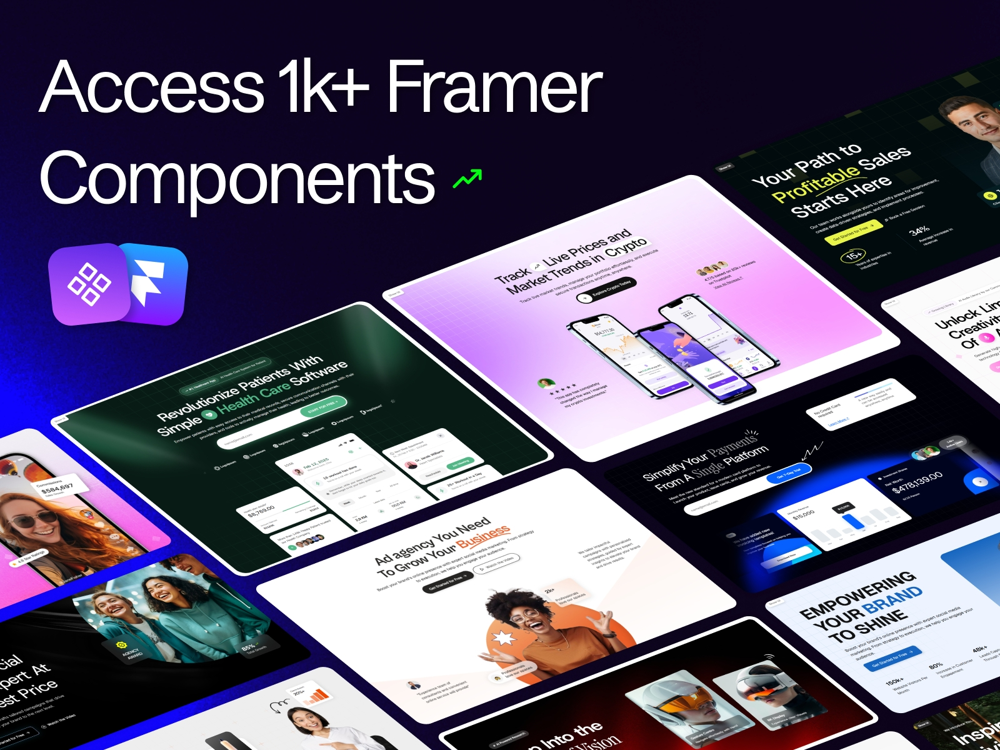
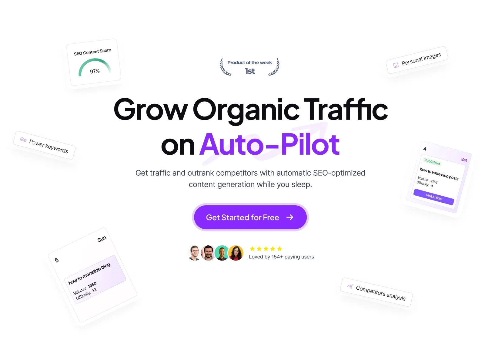
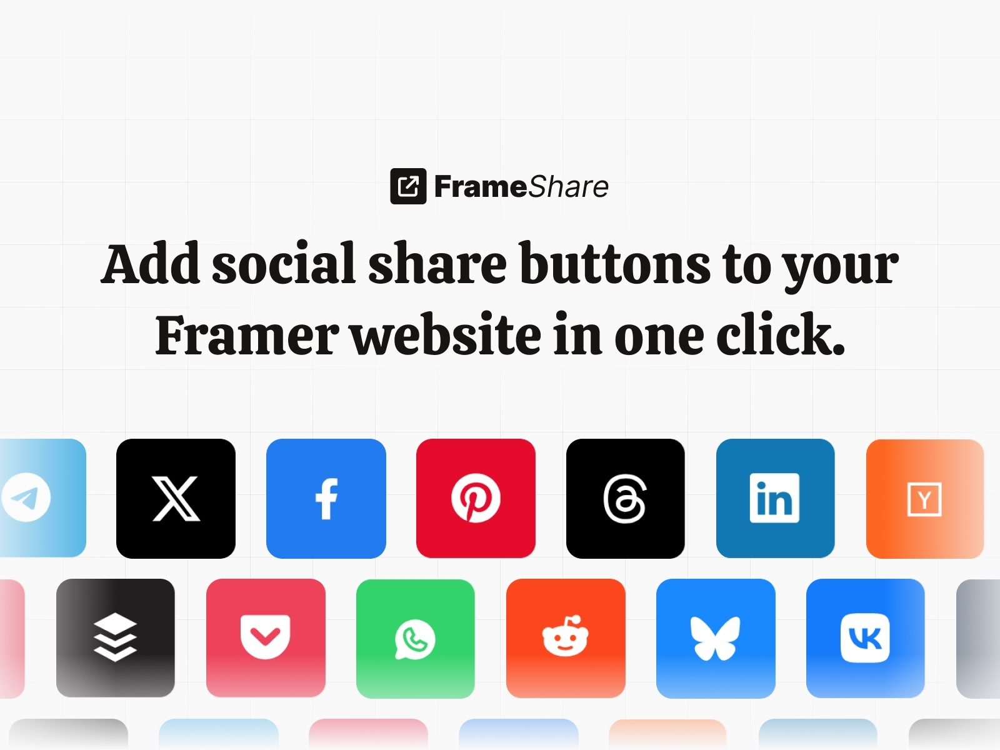

# Best Framer Plugins to Start a Blog

Starting your first blog can feel a bit overwhelming, especially when you're already focused on creating beautiful designs in Framer. With the right plugins, you can launch a professional blog that looks great and actually works.

Here are three essential Framer plugins that'll get your blog up and running without the usual headaches. Whether you're building a personal portfolio or launching a business site, these tools will sort out the heavy lifting whilst you focus on what you do best.

## 1. [Framify](/plugins/framify): Build Your Blog Foundation Fast

Before you can start blogging, you need a proper foundation – and that's where [Framify](/plugins/framify) comes in handy. This plugin is basically a massive library of professionally-designed components, sections, and complete page templates that you can drag straight into your Framer projects.

What makes Framify brilliant for new bloggers is that it takes care of all the fiddly design work you'd normally spend hours on. Need a header? It's there. Want a clean article layout? Sorted. Looking for a contact page template? Done. The plugin includes everything you need to build a cohesive blog design without starting from a blank canvas.

The regular updates mean you're always getting fresh components, and the quality is consistently high across the board. For designers who want their blog to look professional from day one, Framify removes the guesswork. You can focus on customising colours and fonts to match your brand rather than wondering how to structure a blog post template.

It's particularly useful if you're new to Framer or blogging in general. Instead of getting stuck on layout decisions, you can get your blog live quickly and then refine it as you go.

Price: **Paid**  
Plugin link: [Framify](/plugins/framify)

## 2. [Outrank](/plugins/outrank): Let AI Handle Your Content

Here's the thing about blogging – you need regular content to keep people interested and search engines happy. But if you're a designer, writing dozens of blog posts probably isn't how you want to spend your time. Enter [Outrank](/plugins/outrank), the plugin that basically gives you a robot content team.

Outrank uses AI to automatically generate SEO-optimised blog posts for your Framer site. It's not just throwing together random words either – it actually researches profitable keywords, crafts proper articles around them, and publishes everything directly to your site. Think of it as having a content manager who never takes a day off.

What's particularly clever is how hands-off the whole process is. You don't need to brainstorm topics, research keywords, or sit there writing. Outrank handles the lot, which means you can focus on designing whilst your blog fills up with quality content that actually helps with SEO.

This is especially useful if you're running a design agency or portfolio site where regular blog updates can attract new clients. Instead of letting your blog sit empty (we've all been there), Outrank keeps it active and working for your business.

Price: **Paid**  
Plugin link: [Outrank](/plugins/outrank)

## 3. [FrameShare](/plugins/frameshare): Get Your Content Shared

Creating great blog content is only half the battle – you need people to actually see and share it. [FrameShare](/plugins/frameshare) solves this by making it dead simple to add social sharing buttons to your Framer blog.

The plugin supports over 20 platforms, including all the usual suspects like Facebook, Twitter, LinkedIn, and Reddit. What's handy is that it automatically pulls in your page URL and title, so there's no faff for your readers. They just click and share – job done.

FrameShare also includes options for printing, copying links, and email sharing. This might not sound exciting, but it covers all the ways people actually share content. Some prefer social media, others want to email a link to a colleague, and some still like to print things out. With FrameShare, you're covering every base.

The customisation options mean the buttons can match your design perfectly, so they don't look like an afterthought stuck onto your carefully crafted blog layout.

Price: **Paid**  
Plugin link: [FrameShare](/plugins/frameshare)

These three plugins work brilliantly together to solve the main challenges of starting a blog: design, content, and promotion. Framify gets your blog looking professional quickly, Outrank keeps it filled with quality content, and FrameShare helps that content reach more people.

The beauty of this setup is that it's almost entirely automated once you've got everything configured. You can focus on what you're good at, whilst your blog works away in the background, attracting visitors and building your online presence.

*Want to explore more plugins for your Framer projects? Check out our [complete collection of Framer plugins](/plugins) to find more tools that match your design needs.*