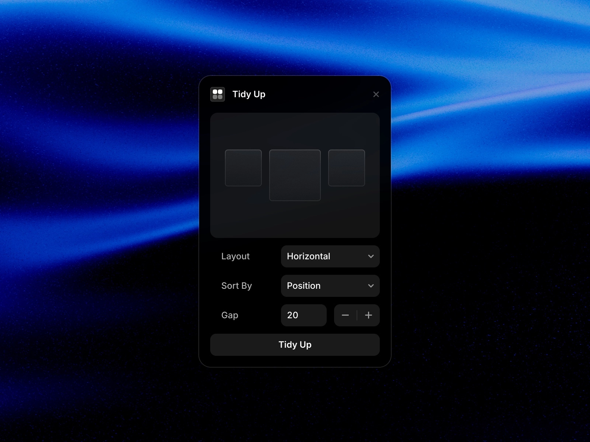
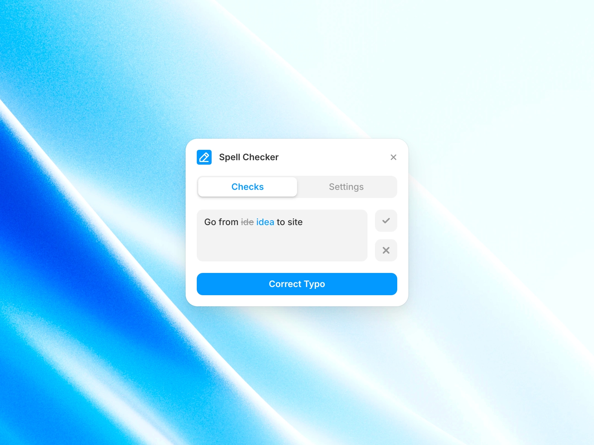
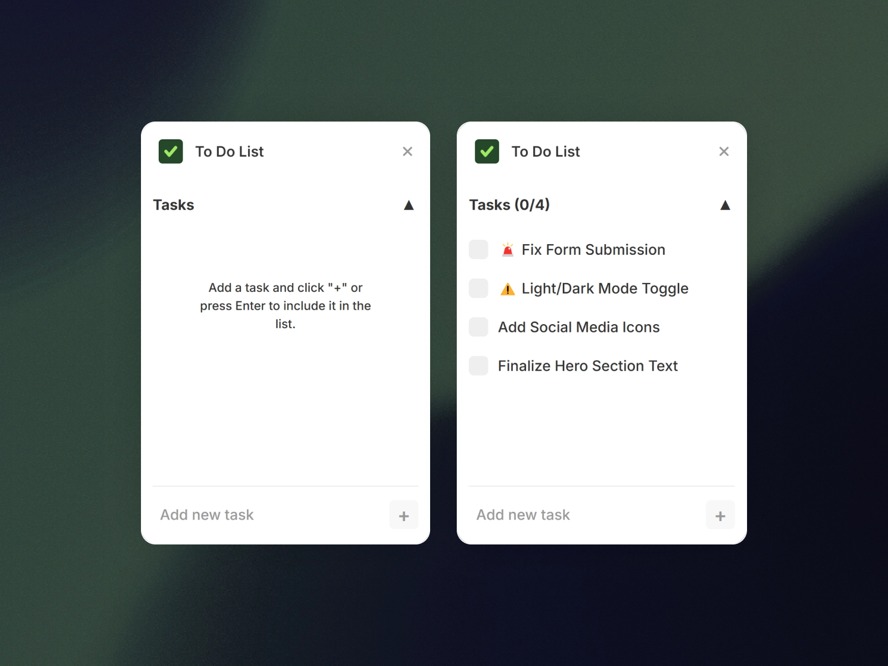
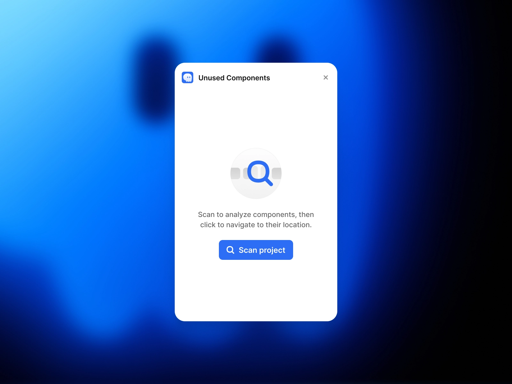

As designers, we're always looking for ways to work smarter, not harder. 

If you're using Framer for your design projects there are some brilliant plugins that can help you speed up your workflow and keep your projects organised. 

Let's look at four fantastic free plugins that will boost your productivity.

## 1. [Tidy Up](/plugins/tidy-up)

Ever felt overwhelmed by messy frames and scattered elements in your design? 

The [Tidy Up plugin](/plugins/tidy-up) is like having a virtual assistant who organises your desk in seconds. With just one click, it neatly arranges all your pages, breakpoints and frames.

What makes this plugin particularly brilliant is its flexibility. 

You can choose whether you want your elements arranged horizontally, vertically or in a grid pattern.

Plus, you can adjust the spacing between frames to match your design style. It's perfect for those moments when you need your design to look professional quickly, without spending ages manually moving things around.

Price: **Free** 
Plugin link: [Tidy Up](/plugins/tidy-up)

## 2. [Spell Checker](/plugins/spell-check)

We've all been there – spending hours on a beautiful design only to spot a glaring typo after sharing it with the client. 

The [Spell Checker plugin](/plugins/spell-check) acts like your personal proofreader, catching those pesky spelling and grammar mistakes before anyone else sees them.

This plugin is quite clever. It can check text in multiple languages and fix all the typos on a page with one click. 

The free version gives you all the essential features you need, but there's also a Pro plan if you're working with a team. 

Best of all, it keeps your text private and secure, so you don't have to worry about sensitive content being processed online.

Price: **Premium** 
Plugin link: [Spell Checker](/plugins/spell-check)

## 3. [To Do List](/plugins/todo-list)

Keeping track of design tasks can be a bit of a headache, especially when you're juggling multiple projects. 

The [To Do List plugin](/plugins/todo-list) brings task management right into your Framer workspace, so you don't need to keep switching between different apps.

What's really handy about this plugin is how it saves space. You can collapse it when you need more room to work. It automatically saves your tasks too, so you won't lose track of what needs doing even if you close Framer. 

It's like having a smart notepad that remembers everything for you and celebrates when you tick off all your tasks!

Price: **Free** 
Plugin link: [To Do List](/plugins/todo-list)

## 4. [Unused Components](/plugins/unused-components)

The [Unused Components plugin](/plugins/unused-components) is like a Marie Kondo for your Framer projects. It helps you spot and remove elements that aren't sparking joy (or in this case, aren't being used). 

This is especially useful when you're working on bigger projects where it's easy to lose track of what components you actually need.

The plugin scans your entire project and shows you which components are just taking up space. You can quickly jump to where components live in your project structure and remove the unused ones with a single click. 

If you accidentally delete something you needed, don't worry – there's an undo feature to get it back.

The best part? Removing unused components helps keep your project files smaller and faster to work with.

Price: **Free** 
Plugin link: [Unused Components](/plugins/unused-components)

**Ready to Level Up Your Design Workflow?**

These plugins are just the tip of the iceberg when it comes to improving your productivity in Framer.

Each one tackles a different aspect of the design process, from organisation and proofreading to task management and project cleanup. And they're all free to use, so you can try them out without any risk.

Want to explore more ways to enhance your Framer workflow? Check out our [complete collection of productivity plugins](/categories/productivity), we're constantly updating our list with the latest and greatest tools to help you work more efficiently.

You may also want to read about:
- [Best Framer Plugins for Ecommerce](/blog/best-framer-plugins-for-ecommerce)
- [Best Framer Plugins to Start a Blog](/blog/best-framer-plugins-start-blog)
- [Best Framer Plugins for Search Engine Optimisation](/blog/best-framer-plugins-for-search-engine-optimisation)

