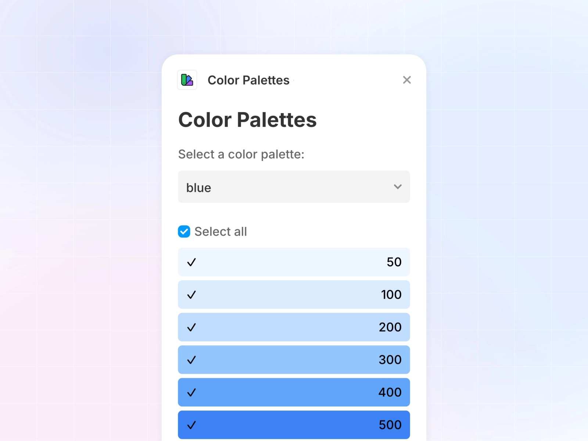
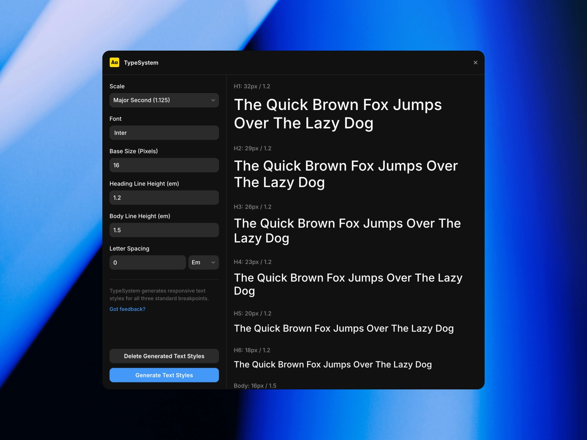

Starting a new Framer project can feel a bit overwhelming. With so many design decisions to make, having the right tools from the beginning can make a massive difference. Let's look at three essential plugins that will help you kick off your next project with confidence.

## 1. [Color Palettes](/plugins/color-palettes)

Choosing the right colour scheme can be tricky, but the [Color Palettes plugin](/plugins/color-palettes) makes it a breeze by bringing Tailwind's popular colour system directly into Framer. 

The best part? It's completely free! With just a click, you can add any of Tailwind's carefully crafted colour palettes to your project. 

Need a dark mode version? The plugin's got you covered – it automatically generates inverted colour palettes, saving you loads of time. 

It's perfect for creating professional-looking designs without getting stuck in the colour selection process.

Price: **Free**  
Plugin link: [Color Palettes](/plugins/color-palettes)

## 2. [TypeSystem](/plugins/typesystem)

Typography can make or break a design, and [TypeSystem](/plugins/typesystem) helps you nail it from the start. This free plugin generates responsive text styles based on proven type scales, giving you a solid foundation for your project's typography. 

What's particularly clever about TypeSystem is how it creates a complete set of styles – six heading styles and two body styles – with just one click.

These aren't just random sizes either; they're carefully scaled to work well together and look good on all devices. If you need to tweak things later, you can easily customise the styles or even start fresh by clearing them all at once.

Price: **Free**  
Plugin link: [TypeSystem](/plugins/typesystem)

## 3. [Clonify](/plugins/clonify)

Think of [Clonify](/plugins/clonify) as your digital box of Lego blocks for web design. This premium plugin gives you access to over 1,000 pre-designed sections and templates that you can mix and match to create your website. 

Instead of starting from scratch, you can drag and drop professionally designed components right onto your canvas.What makes Clonify particularly brilliant is its versatility. 

Whether you prefer working with wireframes to plan your layout or want to dive straight into fully designed sections, the choice is yours. The Pro version even includes complete source files and a design system, which is brilliant if you're working on client projects or need to maintain consistency across multiple pages.

Price: **Paid**  
Plugin link: [Clonify](/plugins/clonify)

These three plugins form a powerful foundation for any new Framer project. Clonify provides the building blocks, Color Palettes sorts out your colour scheme, and TypeSystem handles typography – covering three of the most crucial aspects of web design. Together, they'll help you work faster and more efficiently, letting you focus on the creative aspects of your project rather than getting bogged down in the basics.

*Want to explore more plugins for your Framer projects? Check out our [complete collection of Framer plugins](/plugins) to find more tools that match your design needs.*