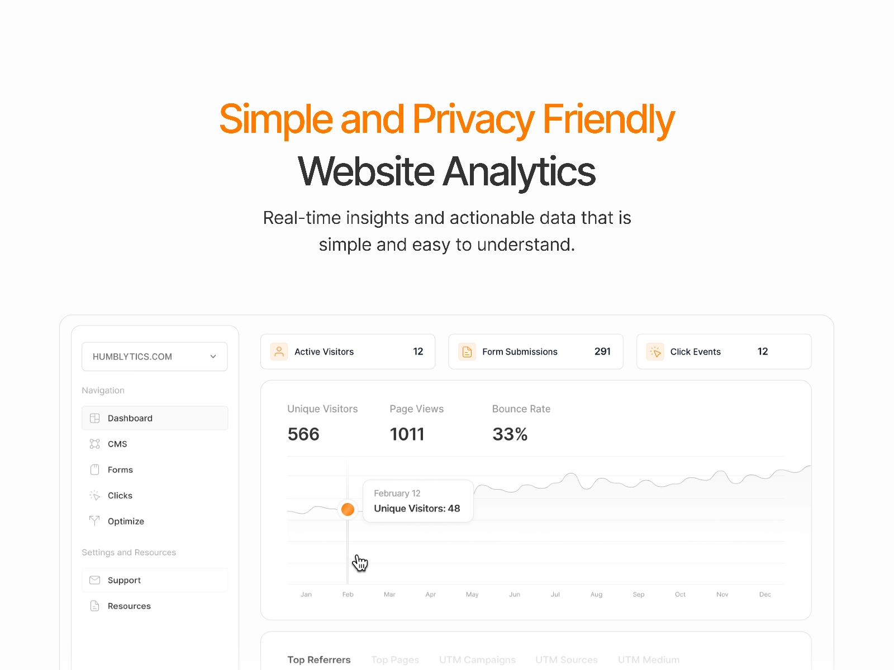

Understanding how visitors interact with your website is crucial for making informed design decisions. If you're using Framer to build your site, you're in luck – there are some brilliant analytics plugins available that make tracking and analysing your website's performance a breeze.

Let's explore two top-notch analytics plugins that can help you gather valuable insights about your visitors whilst respecting their privacy.

## 1. [Humblytics](/plugins/humblytics)

If you're after a straightforward analytics solution that's built specifically for Framer, [Humblytics](/plugins/humblytics) might be just what you need. This plugin is particularly interesting because it manages to provide comprehensive analytics without using any cookies – quite impressive!

What makes Humblytics stand out is its focus on simplicity and integration with Framer's ecosystem. You can track all sorts of useful things like traffic patterns and custom events, but the real gem is its A/B testing capability. Want to see which version of your heading works better? You can do that without leaving Framer or touching any code.

For content creators and designers, Humblytics offers some particularly useful features. It can track how far people scroll down your pages and how long they spend on them, which helps you understand if your content is actually engaging visitors. Plus, you can track specific interactions like clicks and form submissions without needing to write any code – perfect if you're more comfortable with design than development.

Price: **Paid**  
Plugin link: [Humblytics](/plugins/humblytics)

## 2. [Fathom Analytics](/plugins/fathom-analytics)

[Fathom Analytics](/plugins/fathom-analytics) takes a different approach, positioning itself as a privacy-focused alternative to Google Analytics. If you've ever felt overwhelmed by Google Analytics' complex interface (haven't we all?), you'll appreciate Fathom's straightforward approach.

What's brilliant about Fathom is that it strikes a nice balance between simplicity and functionality. You get all the essential stats you need without drowning in data. It's also properly GDPR-compliant and doesn't use cookies, which means less hassle with those annoying cookie consent popups.

While it does require a monthly subscription starting at £10.50, Fathom offers unlimited data retention – meaning you can look back at your stats from years ago if you need to. They've even thought about making the switch easier by providing an importer for your existing Google Analytics data.

The plugin itself is dead simple to set up in Framer. There's no need to faff about with code or header tags; it's genuinely just a plug-and-play solution.

Price: **Paid**  
Plugin link: [Fathom Analytics](/plugins/fathom-analytics)

Both plugins offer solid analytics solutions, but they cater to slightly different needs. Humblytics might be your best bet if you want deep integration with Framer and built-in A/B testing capabilities. On the other hand, if you're looking for a more traditional analytics solution with a focus on privacy and simplicity, Fathom Analytics could be the way to go.

The choice really depends on what you value most: Framer-specific features or a broader analytics solution that you could potentially use across different platforms.

*Want to explore more plugins for your Framer projects? Check out our [complete collection of Framer plugins](/plugins) to find more tools that match your design needs.*