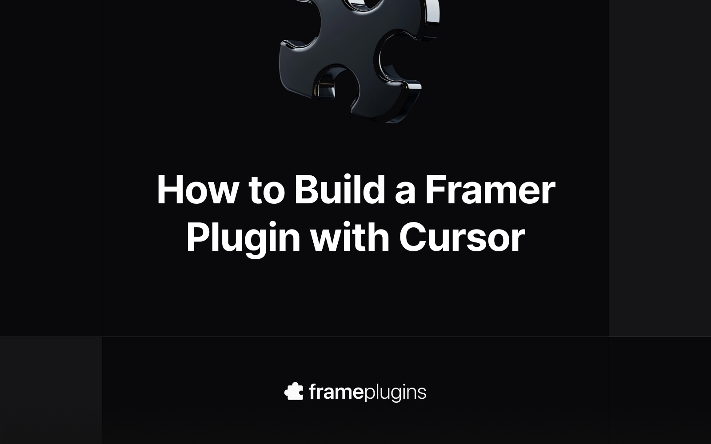

Over the past year I’ve released a couple of Framer plugins on the official marketplace - [Color Palettes](https://framer.link/iki4qCX) (free), [FrameShare](https://framer.link/iki4qCX) (premium) and more recently [MetaViewer](https://framer.link/V0urDh8) (freemium). I built all of them using Cursor, an AI-powered code editor that helps you write and edit code through conversation.

Recently, I started getting messages from people on [X](https://x.com/julesvcode) asking how I actually built them. I realised that a lot of Framer users aren’t developers or React experts, so the idea of building a plugin can sound intimidating at first.

That’s why I decided to write this post: I want to walk you through the process for building Framer plugins with the help of AI in Cursor.

I won’t be teaching you how to code but I’ll show you how to get started and build your own plugins using Cursor. I’ve even made a Framer Plugin Starter Kit to make it super easy to set everything up.



## 1. What You’ll Need Before Starting

Before we dive in, here’s what you’ll need to get started:

- [Framer account](https://framer.link/julesvcode): you’ll need this preview and test your plugin inside a project in Framer.
- [Cursor](https://cursor.com/): download and install Cursor on your machine. It’s the code editor we’ll be using to build the plugin.
- [GitHub account](https://github.com/): you’ll need this to clone the Starter Pack repository and save your code for the plugin. If you don’t have one yet, it only takes a minute to [create an account](https://github.com/join).
- [The Framer Plugin Starter Kit](https://github.com/julesvcode/framer-plugin-starter-kit): this is the boilerplate we'll use to speed up the setup.
- Node.js + npm + Git – those are tools that are needed to run and manage the code for your plugin. I’ll tell you how to check if you have those installed in the next step.
- An idea for the plugin you want to build.

## 2. Prerequisites

First, we need to make sure you have Git, Node.js and npm installed on your machine before we can start the setup.

**Check if Node, npm and Git are installed:**

**On macOS:**

1. Open the **Terminal** (press `Command + Space`, type “Terminal”, hit Enter).
2. Type `node -v` and press Enter.
3. Then type `npm -v` and press Enter.
4. Then `git --version` and press Enter.

If all return a version number, you’re all set.
    

**On Windows:**

1. Open **Command Prompt** (press the Windows key, type “cmd”, hit Enter).
2. Type `node -v` and press Enter.
3. Then type `npm -v` and press Enter.
4. Then `git --version` and press Enter.

If you see version numbers, you’re good to go.
    
If `node -v` doesn’t return a version number, download and install [Node.js](https://nodejs.org/en) — it includes npm automatically. Once it’s installed, repeat the steps above to confirm everything works.

If `git --version` returns something like `command not found: git`. In that case, you'll need to install it:

- **macOS:** install [Homebrew](https://brew.sh/) and run `brew install git` in the terminal, or download Git directly from [git-scm.com](https://git-scm.com/).
- **Windows:** download and install Git from [git-scm.com](https://git-scm.com/). The installer automatically sets up everything you need.

## 3. Setting Up Your Project in Cursor

To make things easier for you, I’ve put together a [Framer Plugin Starter Kit](https://github.com/julesvcode/framer-plugin-starter-kit) available on GitHub as a public repository. It’s basically the project files provided by Framer, with **Tailwind CSS** added on top (to make it easier for Cursor to style the UI). 

The Starter Kit also includes **Cursor rules** that guide the AI on how to build a Framer plugin correctly — including how to use **Framer’s own CSS variables** for colours, as well as documentations for Lemon Squeezy, Polar and Stripe in case you want to add a paywall or integrate payments in your plugin.

Now let’s set everything up in Cursor.

### Step 1 – Clone the Starter Kit

1. Open your Terminal 
    - On macOS: press `Command + Space`, type “Terminal”, and hit Enter.
    - On Windows: press the Windows key, type “cmd”, and hit Enter.
2. Type the command below and hit Enter to navigate to your "Documents" folder

```bash
cd Documents
```

1. Type the command below and hit Enter to clone the GitHub repo with the starter kit

```bash
git clone https://github.com/julesvcode/framer-plugin-starter-kit.git
```

1. Navigate to the Starter Kit folder with the command below:

```bash
cd framer-plugin-starter-kit
```

1. Open the folder in Cursor with the command below:

```bash
cursor .
```

### Step 2 – Install the Dependencies

Once Cursor is open:

1. Go to View > Terminal to open the built-in terminal
2. Run the command below to install all the project files:

```bash
npm install
```

3. That’s it! You’re all set to make a start on your Framer plugin

## 4. What You Need to Know

Now that you’ve got the project open in Cursor, let’s go through the essentials so you know what’s what before you start building.

### Your project files:

On the left-hand side, you’ll see a few key files and folders:

- `package.json`: this file contains your plugin’s basic info (name, version, dependencies).
- `framer.json`: this file tells Framer how to display your plugin name and icon. You’ll come back here if you ever want to rename your plugin.
- `src/`: this is where your actual plugin lives. Inside, you’ll find:
    - `App.tsx`: the main file where your plugin’s code and UI go.

If you ask Cursor something like *“Explain what each file in this project does”*, it’ll walk you through them in plain English, which is a great way to explore.

### Previewing your plugin in Framer

Once you’ve made changes or just want to see your plugin in action, you can preview it in Framer:

1. Run the following command in the in-built terminal:
    
```bash
npm run dev
```

This starts a local development server.
    
2. Open **Framer**
3. Click on the **Plugins** button (as if you were searching for an existing plugin)
4. Click **Browse All..**
5. And select **Open Development Plugin..**

On macOS you can use the following shortcut: `cmd + option + L`

Framer will load your plugin so you can test it live. Any changes you make in Cursor will automatically update when you save.

### Changing the name of your plugin

You’ll need to update it in **two places**:

1. In `package.json`, update the `"name"` field on Line 2.
2. In `framer.json`, update the `"name"` field on Line 3 too — this is the one that appears inside Framer.

Example:

```json
// Change from:
{
  "name": "Framer Plugin Starter Kit"
}

// to:
{
  "name": "FrameShare"
}
```

3. Save the files and preview the plugin in Framer to see the new name.

### Changing the icon of your plugin

1. Create or download a square icon (ideally **180x180px** SVG) and name it `icon.svg`.
2. Drag the file from your Finder/File Explorer into the  `public/` folder.
3. You may need to restart your server to see the new icon in the preview

### Restart your server

Sometimes you’ll see that your changes are not visible in the preview on Framer or something may seem to be stuck. In that case, you can restart the local server by clicking in the in-built terminal window and pressing **Control + C** to stop it. 

Then you’ll need to run this command to start the server again to preview the plugin in Framer:

```bash
npm run dev
```

That’s all you need to know for now - you’ve got the setup, structure, and preview ready. Next, we’ll actually make the plugin do something with Cursor.

## 5. Building Your Plugin with Cursor

Now that everything’s set up, you can start building. 

There’s no single right way to do it, but here are a few tips to help you get the best results from Cursor and keep your project clean as it grows.

### Give Cursor context first

Before typing any feature prompt, start by asking Cursor to **index the project** so it understands your codebase:

> “Index this project so you can understand the structure and files.”
> 

Then, explain what you want to build — even in plain language. For example:

> “I want to build a plugin that helps users [do X]. I want to include the following features: [feature 1], [feature 2], etc.. What’s the best way to structure this, and can you create a to-do list of tasks for it?”
> 

Cursor will suggest a plan and break it down into steps. You can then work on one small task at a time. This makes it easier to follow along and keeps Cursor focused.

### Build in small chunks

Instead of asking Cursor to “build the Framer plugin,” tackle one feature at a time.

For example:

> “Let’s start with adding [feature 1].”
> 
> 
> “Now let’s move to [feature 2].”
> 

Breaking the work into small tasks gives you more control and helps you understand what’s happening as Cursor updates your code.

### Commit your work regularly

Think of commits like **checkpoints in a video game**.

Each time you add a new feature and confirm it works, make a commit in Cursor:

- In the top-left corner, click on the **network icon** (next to the magnifying glass).
- Type a short message describing the feature you’ve just added or the bug you’ve fixed.
- Press **Commit** (the first time, the button might say “Publish branch”).

This saves your progress to your GitHub repository, and if something breaks later, you can easily roll back to a previous working version without starting over.

### Use Framer’s own CSS variables

Your plugin should automatically adapt to Framer’s light and dark modes. To make sure it does, the Starter Kit includes a Cursor rule to use **Framer’s existing CSS variables** (for colours, borders, typography, etc.) whenever it styles something.

If Cursor ever adds hardcoded colours, just say:

> “Update this to use Framer’s built-in CSS variables instead of fixed colours.”
> 

This keeps your plugin looking consistent with Framer’s UI.

### Paid vs free plugins

If you want to make your plugin paid or freemium, you can use payment platforms like **Lemon Squeezy**, **Polar** or **Stripe**, which have great APIs for this. The Starter Kit includes rules to help you set this up - simply explain to Cursor how and when you want users to pay to use the plugin.

### Test your plugin like a user

Testing depends on what your plugin does, but a good rule is: **use it like your users would**.

Try it inside the Framer app and also test it when using Framer in the browser (Safari, Chrome, Firefox). Make sure everything feels smooth, that it saves state properly, and that it looks right in both light and dark themes.

## 6. Publishing Your Plugin

Once your plugin is working and you've tested it, it’s time to publish it on Framer.

### Package your plugin

Before publishing, make sure everything is tidy:

- Remove any unused files or test code (you can ask Cursor to do this for you).
- Double-check your `framer.json` file to make sure the name is correct.
- Then, run the following command in the in-built terminal:
    
```bash
npm run pack
```

This command will create a `plugin.zip` within your folder. This is the file you’ll need to upload to Framer for your submission.

### Create your assets and copy

You’ll need a few things before submitting:

- **Cover images** – a mockup that shows what your plugin does and what it looks like.
- **Tagline, summary** **& description** – explain the purpose of your plugin and what makes it useful. This is what users will see on your plugin’s page on the Framer marketplace.
- **Review instructions** – include anything you want the reviewer to be aware of when reviewing your plugin (e.g. if your plugin is a paid one, make sure to include a license key the reviewer can use to access the plugin).

If you need help, simply look at other plugins on the [Framer Plugin marketplace](https://framer.link/FqqP7D7) to get some inspiration.

### Submit to the official marketplace

Head over to the Plugins tab in your Creator Space (apply [here](https://framer.link/fHxcDVs) if you’re not a Creator yet) and click **New Plugin**.

You’ll be asked to upload your plugin file, add your details, and set the pricing (free, freemium, or paid).

Once submitted, the Framer team will review it. This can take a few days and if they request changes, you can update your plugin and resubmit it easily.

### Get more exposure

Once your plugin is live on the Framer marketplace, share it on community sites to get more visibility:

- [Frameplate](https://frameplate.co)
- [Frameplugins](/)

These directories help Framer users discover new plugins and can drive more traffic to your listing.

That’s pretty much everything you need to start building Framer plugins with Cursor.

The goal is to **start small**, experiment, and learn as you go. You might even learn some coding skills as you go.

If you end up building your first plugin using this guide, I’d love to see it. Tag me on [X](https://x.com/julesvcode) so I can check it out.

If you spot anything that could be improved or think something’s missing, [feel free to reach out](https://x.com/julesvcode). I’m always open to feedback to make this guide better.