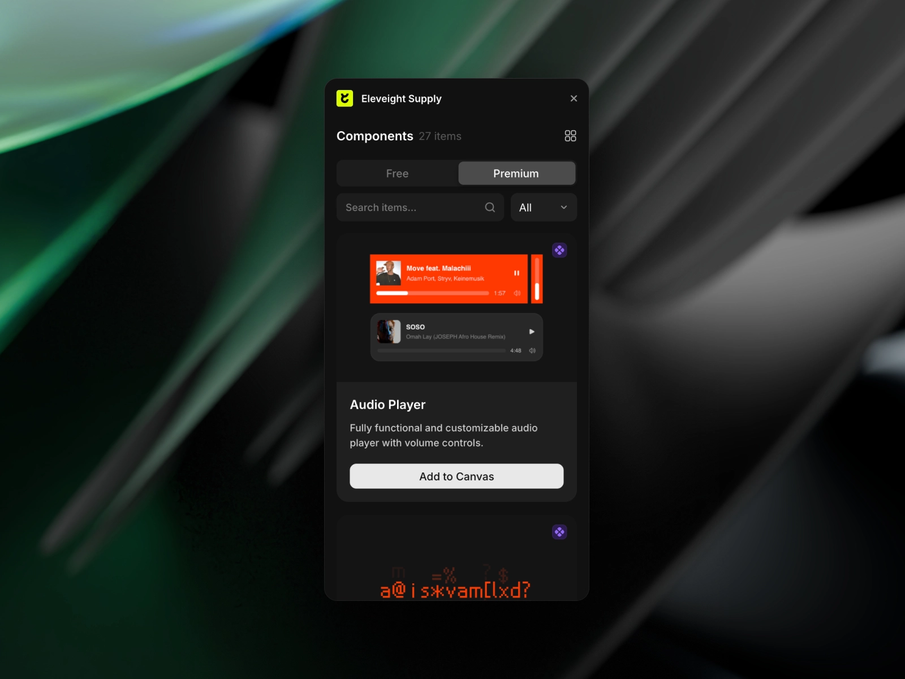

Designing and launching a website can feel like a massive undertaking, but with the right tools, it doesn't have to be. 

If you're using Framer, there are several brilliant plugins that can dramatically speed up your workflow and help you create stunning websites without starting from scratch. Let's explore three standout plugins that are changing the game for Framer designers.

## 1. [Frameblox](/plugins/frameblox)

Leading the pack is [Frameblox](/plugins/frameblox), a comprehensive UI kit that's revolutionising how we build websites in Framer. With over 450 pre-built elements at your fingertips, this plugin is like having a professional design assistant by your side. 

The real magic lies in its drag-and-drop functionality – you can literally piece together entire websites in minutes rather than hours.

What sets Frameblox apart is its collection of ready-made website pages. 

Need a landing page? Done. Contact page? Sorted. 

The plugin comes with various pre-built pages that you can customise to match your brand. Plus, its automated styling feature ensures your website maintains a consistent look without you having to fiddle with every little detail.

Price: **Paid**  
Plugin link: [Frameblox](/plugins/frameblox)

## 2. [Kompa](/plugins/kompa)

If you're after variety and flexibility, Kompa is your new best friend. 

This plugin boasts an impressive library of over 800 responsive UI elements, making it one of the most extensive collections available. What's particularly brilliant about Kompa is that it caters to both free and premium users, making it accessible for designers at any stage of their journey.

Beyond just components, Kompa brings some clever features to the table. Its colour palette generator is a lifesaver when you need to create cohesive design schemes quickly, and the auto-scaled typography ensures your text looks spot-on across all screen sizes. 

With monthly updates adding fresh components, you'll never run out of design options.

Price: **Freemium**  
Plugin link: [Kompa](/plugins/kompa)

## 3. [Eleveight Supply](/plugins/eleveight-supply)

For those looking to add that extra bit of sophistication to their websites, [Eleveight Supply](/plugins/eleveight-supply) offers a curated selection of premium code components and overrides. 

While it might be the newest addition to our lineup, it's quickly making a name for itself with its focus on quality and performance.

What makes Eleveight Supply particularly valuable is its attention to complex use cases. 

The plugin extends Framer's capabilities beyond the basics, allowing you to create more interactive and engaging websites. Each component is optimised for performance, ensuring your final product runs smoothly and professionally.

Price: **Paid**  
Plugin link: [Eleveight Supply](/plugins/eleveight-supply)

Together, these plugins make SEO more approachable for Framer designers. Instead of jumping between multiple tools and platforms, you can handle most of your SEO tasks right where you're already working. Semflow helps you optimise and improve, while Search Console helps you monitor and track progress.

The best part? You can start with the free Search Console plugin to get a feel for SEO tracking, and when you're ready to take your optimisation efforts to the next level, Semflow provides the advanced tools you'll need.

*Want to explore more plugins for your Framer projects? Check out our [complete collection of Framer plugins](/plugins) to find more tools that match your design needs.*